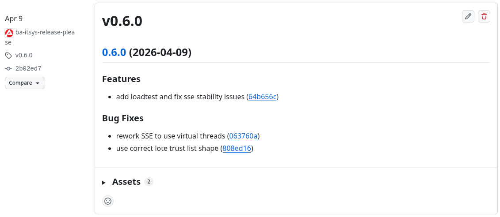

# Release Process and Commit Guidelines
This project uses [release-please](https://github.com/googleapis/release-please) to automate releases. `release-please` parses your commit history to determine version bumps and generate changelogs. This automation relies on [Conventional Commits](https://www.conventionalcommits.org/en/v1.0.0/).

## Table of Contents

- [Conventional Commits](#conventional-commits)
- [Commit Types](#commit-types)
- [Dependabot](#dependabot)
- [Commit Validation (Commitlint)](#commit-validation-commitlint)
- [Best Practices for Better Releases](#best-practices-for-better-releases)
- [The Release Flow](#the-release-flow)

## Conventional Commits

The commit message should be structured as follows:

```
<type>[optional scope]: <description>

[optional body]

[optional footer(s)]
```

**Example:**

```
feat(auth): implement OIDC back-channel logout

This change adds support for OIDC back-channel logout as per the spec.
It ensures that when a user logs out from the provider, all active 
sessions in our extension are invalidated.

Closes #123
```

### Commit Types

The type of commit determines how the version is bumped and where it appears in the changelog. We use the **default Maven configuration** provided by `release-please` (which can be viewed in the [official source code](https://github.com/googleapis/release-please/blob/11fbf2605870d7741a719efe6de50a4487a8b461/src/strategies/java.ts#L35-L48)) unless a project specifically overrides it in its `release-please-config.json`.

| Type        | Section in Changelog     | Version Bump                |
|:------------|:-------------------------|:----------------------------|
| `feat`      | Features                 | **Minor** (e.g., 1.**x**.0) |
| `fix`       | Bug Fixes                | Patch (e.g., 1.0.**x**)     |
| `deps`      | Dependencies             | Patch (e.g., 1.0.**x**)     |
| `docs`      | Documentation            | Patch (e.g., 1.0.**x**)     |
| `revert`    | Reverts                  | Patch (e.g., 1.0.**x**)     |
| `perf`      | Performance Improvements | Patch (e.g., 1.0.**x**)     |
| `chore`     | Miscellaneous Chores     | None                        |
| `style`     | Styles                   | None                        |
| `refactor`  | Code Refactoring         | None                        |
| `test`      | Tests                    | None                        |
| `ci`        | Continuous Integration   | None                        |
| `build`     | Build System             | None                        |

> [!IMPORTANT]
> **Breaking Changes**: Adding a `!` after the type/scope (e.g., `feat!: change API`) or including `BREAKING CHANGE:` in the footer will trigger a **Major** version bump (e.g., 2.0.0).

### Dependabot

Our Dependabot is configured to use the `deps` commit type. These updates are automatically grouped under the "Dependencies" section in our release notes, keeping the changelog clean and informative.

## Commit Validation (Commitlint)

Our CI includes a [Commitlint](https://commitlint.js.org/) check to ensure all commits strictly adhere to the Conventional Commit format. This validation is quite rigorous and includes several constraints based on the default configuration.

If your CI build fails during the commit validation phase, please **check the CI log output**. Commitlint provides specific error messages indicating exactly which part of your commit message violated the rules (e.g., `header-max-length`, `subject-full-stop`, etc.).

## Best Practices for Better Releases

To ensure our auto-generated release notes are high quality, please follow these guidelines:

### 1. Use Atomic Commits
Split your changes into small, logical units. Avoid combining multiple features, fixes, or refactorings into a single commit.
*   **Bad**: `feat: add user login and fix bug in logout`
*   **Good**: 
    *   `feat: add user login`
    *   `fix: resolve race condition in logout`

### 2. Meaningful Scopes
Use scopes to indicate which module or component is affected. This helps reviewers and makes the changelog more structured.
*   Example: `feat(oidc): implement back-channel logout`

### 3. Clear Descriptions
The first line of your commit message is what appears in the changelog. Make it concise and descriptive. Avoid vague messages like `fix: small bug`.

### 4. Provide Context in the Body
If a change requires more explanation, use the commit body. This is useful for future reference and for reviewers, even if it doesn't appear in the main changelog.

## The Release Flow

1.  **Fork the Repository**: Start by forking the repository to your own GitHub account (if you haven't already).
2.  **Work on Branch**: Create your changes on a feature branch.
3.  **Pull Request**: Open a PR. Ensure your commits follow the guidelines above.
    - **Note for New Contributors**: If this is your first time contributing to the project, a maintainer must manually approve and trigger the CI pipeline before it runs on your Pull Request.
4.  **Merge to Main**: When merged, `release-please` will scan the new commits.
5.  **Release PR**: `release-please` will automatically open or update a "Release PR". This PR contains the updated `pom.xml` (or other version files) and the updated `CHANGELOG.md`.
6.  **Snapshots**: For many of our Maven repos, snapshot versions are automatically created upon merging to `main`.
7.  **Finalizing**: Once the "Release PR" is merged, a new GitHub Release is created, and the version is published to Maven Central.


